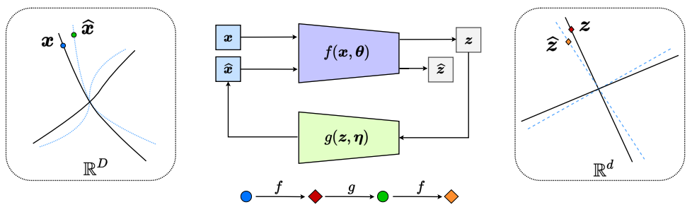

# CTRL — Closed-Loop Data Transcription to an LDR via Minimaxing Rate Reduction

This repository contains the official PyTorch implementation of the paper: 
[Xili Dai](https://delay-xili.github.io/), [Shengbang Tong](https://tsb0601.github.io/petertongsb/), 
Mingyang Li, [Ziyang Wu](https://robinwu218.github.io/), [Michael Psenka](https://www.michaelpsenka.io/), 
[Kwan Ho Ryan Chan](https://ryanchankh.github.io/), [Pengyuan Zhai](https://billyzz.github.io/), 
[Yaodong Yu](https://yaodongyu.github.io/), [Xiaojun Yuan](https://yuan-xiaojun.github.io/Yuan-Xiaojun/), 
[Heung Yeung Shum](https://www.microsoft.com/en-us/research/people/hshum/), [Yi Ma](https://people.eecs.berkeley.edu/~yima/). 
["Closed-Loop Data Transcription to an LDR via Minimaxing Rate Reduction"](https://www.mdpi.com/1099-4300/24/4/456). Special Issue "Information Theory and Machine Learning" of Entropy.

## Introduction
This work proposes a new computational framework for learning a structured generative model for real-world datasets. 
In particular, we propose a framework for closed-loop data transcription between a multi-class, high-dimensional data 
distribution and a linear discriminative representation (CTRL) in the feature space that consists of multiple independent 
multi-dimensional linear subspaces. This new framework unifies the concepts and benefits of auto-encoding (AE) and 
generative adversarial networks (GAN). It naturally extends AE and GAN concepts to the setting of learning a discriminative 
and generative representation for multi-class, high-dimensional, real-world data. Our extensive experiments on many benchmark 
image datasets demonstrate tremendous potential of this new closed-loop formulation: under fair comparison, visual quality 
of the learned decoder and classification performance of the encoder are competitive and often better than existing methods 
based on GAN, VAE, or a combination of both. We hope that this repository serves as a reproducible baseline for future 
research in this area. 

<p align="center">

</p>

The encoder *f* has dual roles: it learns an
LDR *z* for the data *x* via maximizing the rate reduction of *z* and it is also a “feedback sensor” for
any discrepancy between the data *x* and the decoded \hat{x}. The decoder *g* also has dual roles: it is a
“controller” that corrects the discrepancy between *x* and \hat{x} and it also aims to minimize the overall
coding rate for the learned LDR.

## Reproducing Results

### Installation for Reproducibility

For ease of reproducibility, we suggest you install `Miniconda` (or `Anaconda` if you prefer) before executing the following commands.

```bash
git clone https://github.com/Delay-Xili/LDR
cd LDR
conda create -y -n clt
source activate clt
conda install pytorch torchvision torchaudio cudatoolkit=10.2 -c pytorch
pip install git+https://github.com/kwotsin/mimicry.git
mkdir data logs
```
Note: we highly encourage you to use a version of `torch` later then `1.10.0`, since it gives a large speedup when computing `torch.logdet`.

More installation details can be found [here](https://mimicry.readthedocs.io/en/latest/guides/introduction.html).

### Training

To retrain the neural network from scratch on your own machine, execute the following commands 
```bash
CUDA_VISIBLE_DEVICES=0 python main.py --cfg experiments/mnist.yaml
CUDA_VISIBLE_DEVICES=0 python main.py --cfg experiments/cifar10.yaml
CUDA_VISIBLE_DEVICES=0,1 python main.py --cfg experiments/stl10.yaml DATA.ROOT pth/to/the/dataset
CUDA_VISIBLE_DEVICES=0,1,2 python main.py --cfg experiments/CelebA.yaml DATA.ROOT pth/to/the/dataset
CUDA_VISIBLE_DEVICES=0,1,2 python main.py --cfg experiments/LSUN.yaml DATA.ROOT pth/to/the/dataset
CUDA_VISIBLE_DEVICES=0,1,2 python main.py --cfg experiments/ImageNet.yaml DATA.ROOT pth/to/the/dataset
```

Some hyper-parameters can be changed directly in the corresponding `xxx.yaml` file. 
We run the experiments on an NVIDIA RTX 3090 with 24GB memory. 
Adjust the ```CUDA_VISIBLE_DEVICES``` parameter based on available GPUs.


### Pre-trained Models

You can download our trained models from the following links:

| Datasets | Models      | Results     |
| :------: | :---------: | :---------: |
| MNIST    | mini dcgan  | [link](https://drive.google.com/drive/folders/1-eu2qDkF91Bd0RfsCc1YSx9X33SD-Ewy?usp=sharing)    |
| CIFAR-10 | mini dcgan  | [link](https://drive.google.com/drive/folders/1Il2DlJ4KVk6UCa7hgdp5IPu2HDFO3Iz6?usp=sharing)    |
| CIFAR-10 | sngan32     | [TBD](https://drive.google.com/drive/folders/1Il2DlJ4KVk6UCa7hgdp5IPu2HDFO3Iz6?usp=sharing)     |
| STL-10   | sngan48     | [TBD](https://drive.google.com/drive/folders/1V4fsMTUdG-fYOwsY7oW5zBR_rwJY1vcn?usp=sharing)    |
| CelebA   | sngan128    | [link](https://drive.google.com/drive/folders/1GXUsZAYDi3GnckE9KxykHWtRjX7qFuFd?usp=sharing)    |
| LSUN     | sngan128    | [link](https://drive.google.com/drive/folders/10lqlLxP85-uBt7LAEOs_zEb7Yt7lON_u?usp=sharing)    |
| ImageNet | sngan128    | [TBD](https://drive.google.com/drive/folders/11kikjh2sSgX7OeUxLOCXr-CsTuzMoz6K?usp=sharing)    |

Each link includes the corresponding results, which consists of three items: checkpoints, images, and data. <br>
**checkpoints**: including all saved checkpoint files of the generator and discriminator during the training.<br>
**images**: including all saved input and reconstructed images during the training.<br>
**data**: including the Tensorboard file which records the losses and learning rates of discriminator and generator during the training process.

### Evaluating the FID and IS score

To evaluate the FID and IS score of your checkpoints under ```checkpoints/```, execute 

```bash
CUDA_VISIBLE_DEVICES=0 python evaluation.py --cfg experiments/mnist.yaml EVAL.NETD_CKPT path/to/netD/ckpt EVAL.NETG_CKPT path/to/netG/ckpt
CUDA_VISIBLE_DEVICES=0 python evaluation.py --cfg experiments/cifar10.yaml EVAL.NETD_CKPT path/to/netD/ckpt EVAL.NETG_CKPT path/to/netG/ckpt
```

### Testing the classification accuracy

To test the accuracy of your learned discriminator, execute

```bash
CUDA_VISIBLE_DEVICES=0 python test_acc.py --cfg experiments/mnist.yaml --ckpt_epochs 4500 EVAL.DATA_SAMPLE 1000
CUDA_VISIBLE_DEVICES=0 python test_acc.py --cfg experiments/cifar10.yaml --ckpt_epochs 45000 EVAL.DATA_SAMPLE 1000
```


## Citation

If you find CLT useful in your research, please consider citing:

```
@article{dai2021closed,
  title={CTRL: Closed-Loop Transcription to an LDR via Minimaxing Rate Reduction},
  author={Dai, Xili and Tong, Shengbang and Li, Mingyang and Wu, Ziyang and Chan, Kwan Ho Ryan and Zhai, Pengyuan and Yu, Yaodong and Psenka, Michael and Yuan, Xiaojun and Shum, Heung Yeung and others},
  journal = {Entropy},
  volume = {24},
  year = {2022},
  number = {4},
  article-number = {456},
  url = {https://www.mdpi.com/1099-4300/24/4/456},
  issn = {1099-4300},
  doi = {10.3390/e24040456}
}
```

### License

See [LICENSE](LICENSE) for details.